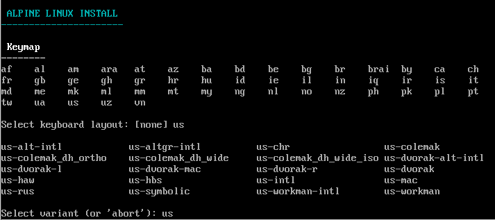
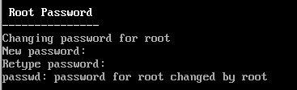

# CREATE A VM UNDER ALPINE LINUX FOR INCEPTION
## INSTALL ALPINE ISO

Go on the Alpine website to [donwload the ISO](https://alpinelinux.org/downloads/), scroll down until you find the virtual section as shown on the picture.

	

## CREATE VM
Open VirtualBox and select new to create a new virtual machine.

	

Fill the following fields as seen on the picture. Some paths may change depending on where you're storing your ISO and virtual machine.

	

The Base Memory and Processors allocated are enough for the VM but you're free to modify these values if you need to.

	

The allocated Disk Size is enough for the VM but you're free to modify the value if you need to.

	

Once you're done filling all the required fields, a summary may appear depending on the version of VirtualBox you're running.

	

You can now start your VM ! :)

	

## SETUP ALPINE ON YOUR VM
Once you've started your VM, connect using the username `root` and type `setup-alpine` to start setting up your VM.

	

You start by choosing your keymap, mine is qwerty so I'm selecting the `us` keymap.

	

I chose my login as my hostame but you're free to choose any name you wish.

	

I did not do any specific configuration here, I left the values by default.

	

Now you need to setup a password for root.

	

Since I'm in Paris, I chose the Paris sub-timezone but you're free to choose anything.

	

I did not configure any proxy, I left the values by default.

	

The NTP client is here to ensure you get the correct dates in your VM.
I chose `openntpd` by preference but you're free to choose any NTP client.

	

An APK mirror is going to provide us with alternative locations to download and update software. I choose the fastest one.

	

I choose not to create a second user as it's not needed for the project but you can create one if you wish. For the ssh server I allowed the root ssh login since I only have a root user. Port forwarding and setting up ssh login is not asked in the project, I did it because it's useful sometimes.

	

Now you're selecting which disk to use to set up the filesystem of your Alpine VM.

	

The installation is complete, you can now reboot your VM.

	

> [!NOTE]
> You may need to remove the ISO from your VM to prevent accidental reinstallation. Steps are shown in images below.

	

	

## 🔗 Links 🔗
[Install docker compose](https://geekscircuit.com/install-docker-docker-compose-on-alpine-linux/)

[Install graphic interface](https://www.linkedin.com/pulse/adding-gui-graphical-user-interface-our-alpine-linux-virtual-ionica)

> [!IMPORTANT]
> Reboot your VM once all installations are done
